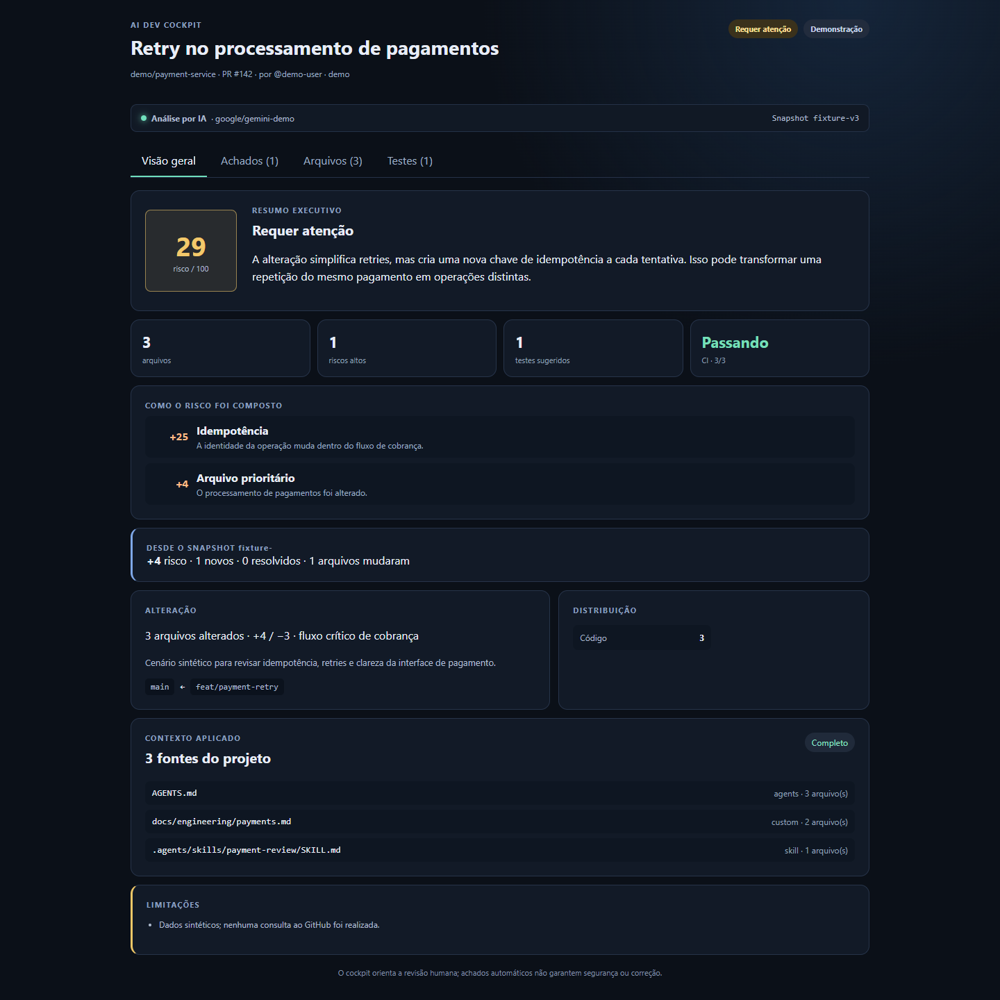
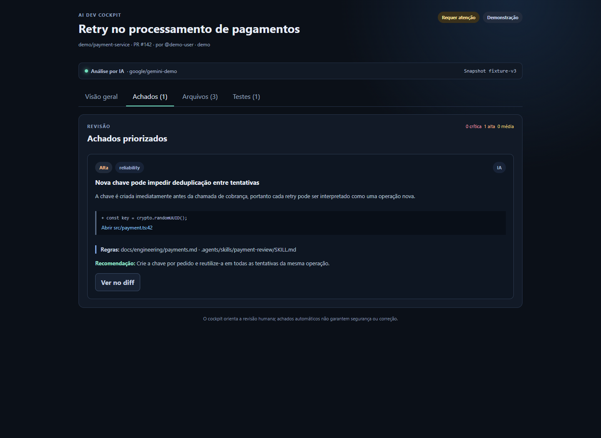
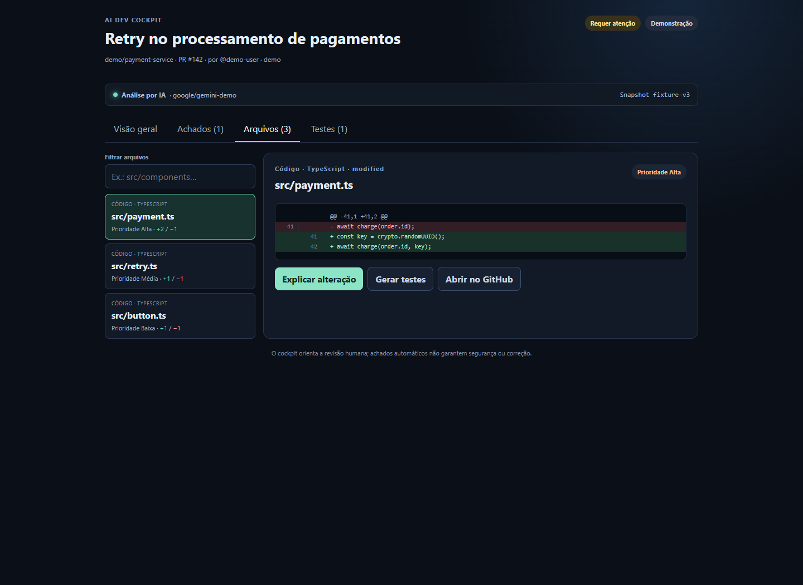
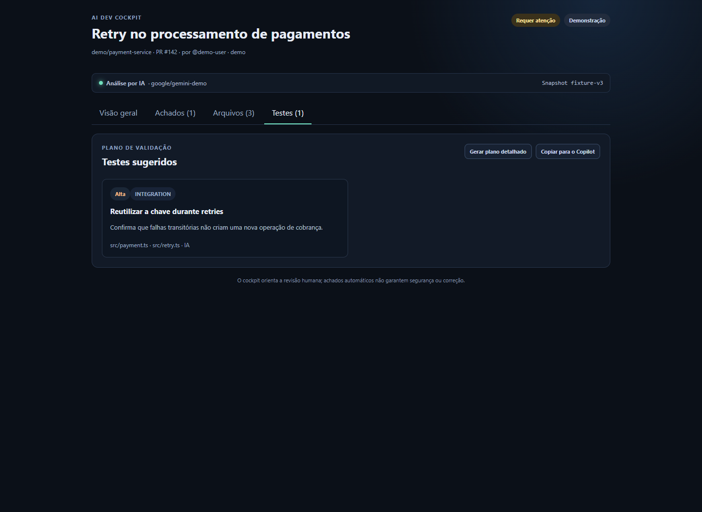
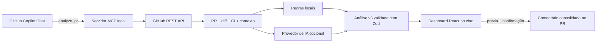

# AI Dev Cockpit

[](https://github.com/branzan-pablo/ai-dev-cockpit/actions/workflows/ci.yml)


Revise Pull Requests reais sem sair do chat. O AI Dev Cockpit é um servidor MCP com uma interface React incorporada ao GitHub Copilot Chat: ele lê o snapshot do PR, entende as regras do repositório, analisa o diff e transforma a revisão em um painel navegável e acionável.

> O projeto não faz checkout nem executa código do PR. A análise é fixada ao `head SHA` e sempre preserva a revisão humana como decisão final.



## Por que usar

- **Contexto do projeto:** considera `AGENTS.md`, instruções do Copilot, guias de contribuição, configurações e skills textuais.
- **Evidência antes de opinião:** cada achado aponta para o arquivo e trecho que o sustenta.
- **IA opcional:** funciona com Google Gemini, OpenAI ou Vercel AI Gateway, mas mantém um fallback local sem chave.
- **Snapshot confiável:** associa análise, comparação e publicação ao commit exato do PR.
- **Fluxo seguro:** não executa código, redige segredos conhecidos e exige prévia antes de escrever no GitHub.
- **Interface dentro do chat:** visão executiva, achados, diff, explicações e plano de testes no mesmo resultado MCP.

## Demonstração

| Achados com evidências | Diff por arquivo |
| --- | --- |
| [](docs/images/cockpit-findings.png) | [](docs/images/cockpit-files.png) |

<details>
<summary>Ver o plano de testes</summary>



</details>

As imagens usam a fixture sintética incluída no repositório. Nenhum código privado ou credencial aparece nos screenshots.

## Como funciona



1. O Copilot chama `analyze_pr` pelo transporte `stdio`.
2. O servidor consulta metadados, patches, statuses e arquivos de contexto no `head SHA`.
3. O review engine produz uma análise determinística; uma revisão de IA pode substituí-la quando configurada e válida.
4. O dashboard recebe dados estruturados e permite explorar achados, arquivos e testes.
5. A escrita no GitHub só ocorre após gerar uma prévia e confirmar explicitamente a publicação.

## Início rápido

### Requisitos

- Node.js 22.12 ou superior.
- VS Code atualizado com GitHub Copilot Chat e suporte a MCP Apps.
- Token do GitHub opcional para repositórios privados ou maior limite da API.
- Chave de IA opcional. Google Gemini é o caminho recomendado para começar.

### 1. Instale o projeto

```powershell
git clone https://github.com/branzan-pablo/ai-dev-cockpit.git
cd ai-dev-cockpit
npm ci
npm run check
Copy-Item .env.example .env
```

Linux e macOS:

```bash
git clone https://github.com/branzan-pablo/ai-dev-cockpit.git
cd ai-dev-cockpit
npm ci
npm run check
cp .env.example .env
```

### 2. Configure o ambiente

Edite `.env`:

```dotenv
GITHUB_TOKEN=
AI_PROVIDER=google
GOOGLE_GENERATIVE_AI_API_KEY=sua-chave-do-google-ai-studio
GOOGLE_AI_MODEL=gemini-3.8-flash
GOOGLE_AI_FALLBACK_MODELS=
```

O arquivo `.env` é ignorado pelo Git. Nunca coloque chaves em `.vscode/mcp.json`, prompts ou commits.

Crie uma chave do Gemini no [Google AI Studio](https://aistudio.google.com/apikey). ChatGPT Plus não inclui créditos ou autenticação para a API da OpenAI.

### 3. Inicie no VS Code

1. Abra a raiz do projeto no VS Code.
2. Abra [`.vscode/mcp.json`](.vscode/mcp.json).
3. Clique em **Start** ou **Restart** no servidor `ai-dev-cockpit`.
4. Abra o GitHub Copilot Chat em modo **Agent**.
5. Confirme que as tools do servidor estão habilitadas.

Envie:

```text
Use exclusivamente a ferramenta analyze_pr do servidor ai-dev-cockpit,
passando:
- prUrl: https://github.com/owner/repo/pull/123
- useAi: true
- refresh: true
```

Sem `prUrl`, `analyze_pr` abre a demonstração sintética. Use `useAi: false` para forçar a análise local.

## Fluxos no chat

### Analisar sem permitir escrita

```text
Use exclusivamente as ferramentas do servidor ai-dev-cockpit.
Analise https://github.com/owner/repo/pull/123 com analyze_pr,
usando IA e atualização forçada. Não publique nada no GitHub.
```

### Preparar e publicar um comentário

Primeiro gere apenas a prévia:

```text
Use prepare_review_comment do servidor ai-dev-cockpit para preparar
o comentário da análise atual. Não publique ainda.
```

Depois de revisar o conteúdo:

```text
Publique a prévia aprovada usando publish_review_comment do servidor
ai-dev-cockpit, passando confirm como true.
```

O servidor recusa a publicação se o PR tiver recebido novos commits. Comentários posteriores atualizam o comentário anterior do mesmo usuário autenticado, em vez de criar duplicatas.

## Contexto específico do repositório

O Cockpit descobre automaticamente no snapshot analisado:

- `AGENTS.md` da raiz e dos diretórios dos arquivos alterados.
- `.github/copilot-instructions.md`.
- `.github/instructions/*.instructions.md`.
- `CONTRIBUTING.md` e `STYLEGUIDE.md`.
- `package.json`, `tsconfig.json` e configurações ESLint comuns.

Para complementar ou limitar a descoberta, adicione `.ai-dev-cockpit.json` ao projeto analisado:

```json
{
  "version": 1,
  "context": {
    "include": ["docs/engineering/**/*.md"],
    "exclude": ["docs/engineering/archive/**"]
  },
  "skills": [".agents/skills/react-review/SKILL.md"]
}
```

O `AGENTS.md` mais próximo do arquivo alterado tem precedência contextual. Skills são lidas somente como critérios técnicos; scripts, comandos e ferramentas descritos nelas não são executados.

Limites atuais: 20 fontes, 8.000 caracteres por fonte e 40.000 caracteres de contexto. Conteúdo excedente é marcado como parcial.

## Provedores de IA

| Provedor | Configuração mínima | Modelo padrão |
| --- | --- | --- |
| Google Gemini | `AI_PROVIDER=google` + `GOOGLE_GENERATIVE_AI_API_KEY` | `gemini-3.8-flash` |
| OpenAI | `AI_PROVIDER=openai` + `OPENAI_API_KEY` | `gpt-5.6` |
| Vercel AI Gateway | `AI_PROVIDER=gateway` + `AI_GATEWAY_API_KEY` | `openai/gpt-5.6-luna` |

Sem `AI_PROVIDER`, a detecção prioriza Google, depois OpenAI e então Gateway, conforme as chaves disponíveis.

Diagnóstico mínimo da API:

```bash
npm run doctor:ai -- --probe
```

Revisão sintética completa:

```bash
npm run doctor:ai
```

Os dois comandos podem consumir créditos. Nenhum deles envia um PR real.

## Tools MCP

| Tool | Entrada principal | Comportamento |
| --- | --- | --- |
| `analyze_pr` | `prUrl?`, `useAi?`, `refresh?` | Analisa o snapshot e abre o dashboard. |
| `explain_change` | `analysisId`, `filePath` | Explica um arquivo pertencente ao snapshot. |
| `generate_tests` | `analysisId`, `filePath?` | Retorna um plano sugerido, marcado como não executado. |
| `prepare_review_comment` | `analysisId` | Cria uma prévia Markdown temporária, sem escrever no GitHub. |
| `publish_review_comment` | `analysisId`, `previewId`, `confirm: true` | Publica ou atualiza o comentário após revalidar o SHA. |

## Segurança e privacidade

- O servidor não faz checkout, não instala dependências e não executa código do PR.
- Título, descrição, caminhos, diffs e regras do repositório são tratados como conteúdo não confiável.
- Instruções encontradas no PR não podem autorizar ferramentas, rede, escrita ou revelar dados.
- Segredos de formatos conhecidos são redigidos antes do envio ao provedor de IA.
- A IA recebe no máximo 60.000 caracteres de patches, além do contexto limitado do projeto.
- Patches ausentes, binários, grandes ou truncados aparecem como limitações da análise.
- Publicação exige token com permissão de escrita, prévia válida, confirmação e head SHA inalterado.
- Score e achados orientam a revisão; não garantem segurança, correção ou aprovação de merge.

Leia também a [política de segurança](SECURITY.md).

## Desenvolvimento

```bash
npm run dev        # UI standalone com fixture sintética
npm run typecheck
npm run build
npm test
npm run check
```

`npm start` inicia o servidor MCP por `stdio`; ele deve permanecer aguardando em silêncio. O cliente MCP normalmente cria e encerra esse processo.

Teste opcional contra um PR público real:

```powershell
$env:REAL_PR_URL='https://github.com/owner/repo/pull/123'
npm test
```

Estrutura principal:

```text
apps/mcp-server/      GitHub, contexto, IA, tools e recurso MCP App
apps/cockpit-ui/      Dashboard React empacotado em um único HTML
packages/contracts/   Contratos Zod compartilhados
packages/review-engine/ Regras e classificação determinística
fixtures/             Cenários sintéticos reproduzíveis
tests/                Unidade, transporte stdio e integração opcional
docs/                 Arquitetura, demonstração e troubleshooting
```

## Limites conhecidos

- Até 60 arquivos e 20.000 caracteres de patch por arquivo.
- Commit statuses não representam necessariamente todos os GitHub Check Runs.
- Cache e snapshots ficam apenas em memória e são apagados ao reiniciar o processo.
- O Cockpit abre previews já publicados; ele não cria deployments.
- Execução de build/testes e geração automática de commits não fazem parte da versão atual.

## Documentação

- [Arquitetura](docs/ARCHITECTURE.md)
- [Troubleshooting](docs/TROUBLESHOOTING.md)
- [Roteiro de demonstração](docs/DEMO.md)
- [Plano do projeto](docs/PLAN.md)
- [Changelog](CHANGELOG.md)
- [Política de segurança](SECURITY.md)

Contribuições, sugestões e relatos de problemas são bem-vindos por meio das Issues e Pull Requests do GitHub.
